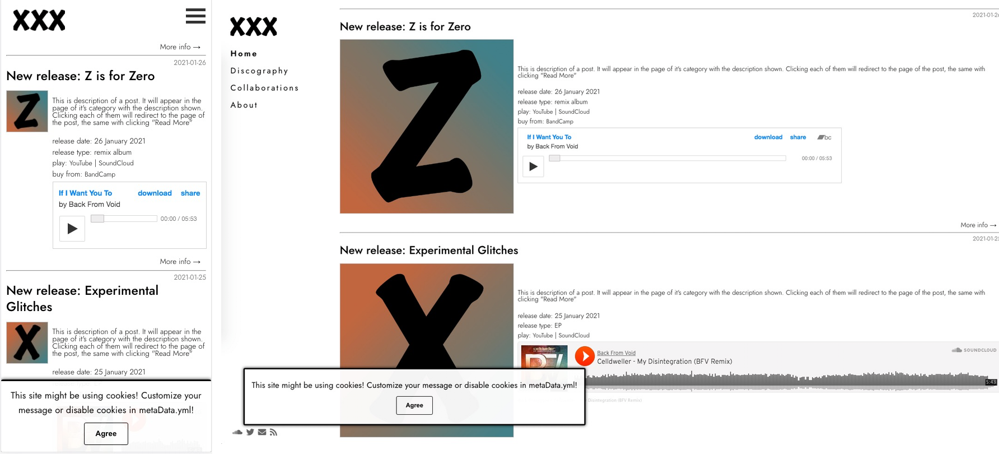

# [minimal-music-project Jekyll theme](https://github.com/ItsMeaga1n/minimal-music-project/)

[](https://raw.githubusercontent.com/mmistakes/minimal-mistakes/master/LICENSE)
[](https://jekyllrb.com/)
[](https://badge.fury.io/rb/minimal-music-project)

minimal-music-project is a flexible Jekyll theme, designed for sites with content easily aggregated into categories. Demo is available [here](https://itsmeaga1n.github.io/minimal-music-project/).



## Installation

Add this line to your Jekyll site's `Gemfile`:

```ruby
gem "minimal-music-project"
```

And add this line to your Jekyll site's `_config.yml`:

```yaml
theme: minimal-music-project
```

And then execute:

    $ bundle

Or install it yourself as:

    $ gem install minimal-music-project

## Usage

This theme is based on separating content into categories, which is later shown on separated sites designated to the specific content type.

As for now, theme allows to use two main categories that will be displayed on home screen and more categories displayed only in menu to further separate content. Those are defined in `_data/menu.yml`.

Structure of `_data/menu.yml`:
* menu_pages: a list of items in menu. Each item contains information:
    * title: Menu position title
    * url: URL for href
    * category: unique identifier of category. Used to determine which menu item is selected
    * tooltip: Tooltip for menu item

Structure of `_data/metaData.yml`:
author: Site Author name
avatar_url: URL for avatar (for about page)

## Contributing

Bug reports and pull requests are welcome on [GitHub](https://github.com/ItsMeaga1n/minimal-music-project). This project is intended to be a safe, welcoming space for collaboration, and contributors are expected to adhere to the [Contributor Covenant](http://contributor-covenant.org) code of conduct.

## Development

To set up your environment to develop this theme, run `bundle install`.

Your theme is setup just like a normal Jekyll site! To test your theme, run `bundle exec jekyll serve` and open your browser at `http://localhost:4000`. This starts a Jekyll server using your theme. Add pages, documents, data, etc. like normal to test your theme's contents. As you make modifications to your theme and to your content, your site will regenerate and you should see the changes in the browser after a refresh, just like normal.

When your theme is released, only the files in `_layouts`, `_includes`, `_sass` and `assets` tracked with Git will be bundled.
To add a custom directory to your theme-gem, please edit the regexp in `minimal-music-project.gemspec` accordingly.

## License

The theme is available as open source under the terms of the [MIT License](https://opensource.org/licenses/MIT).
Custom Volume Slider was developed with the fundaments based on [codepen project](https://codepen.io/EmNudge/pen/rRbLJQ), thus this component is licensed under [Copyright (c) 2021 by EmNudge](https://codepen.io/EmNudge/pen/rRbLJQ).
